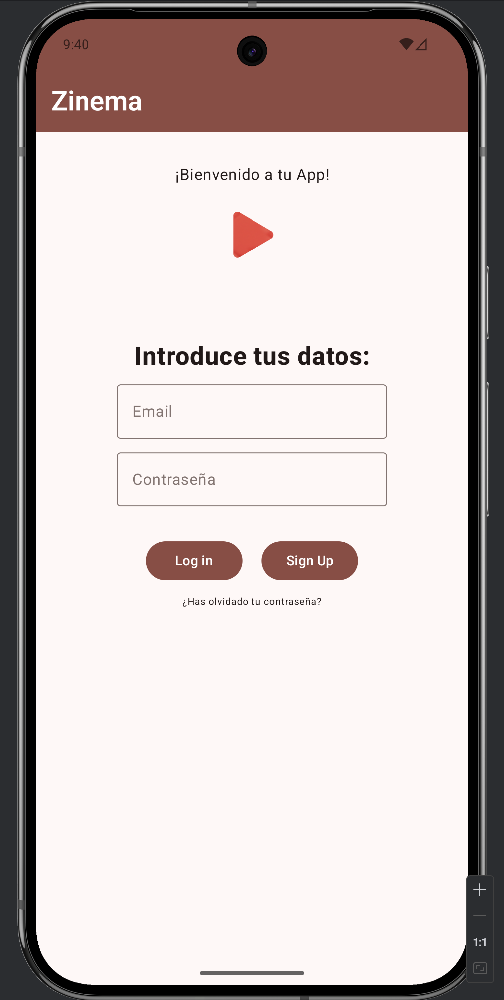
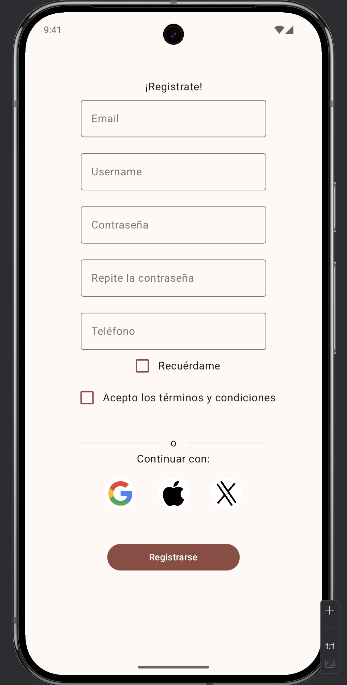
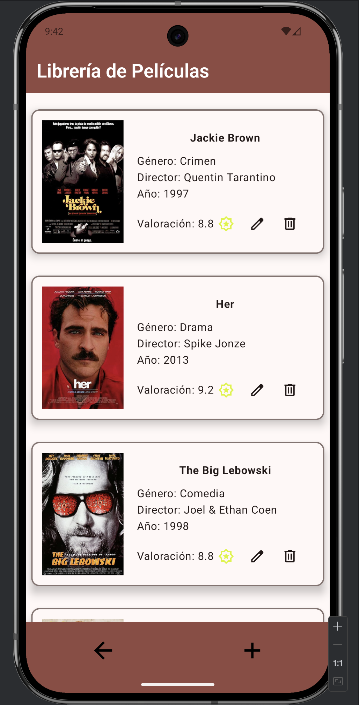
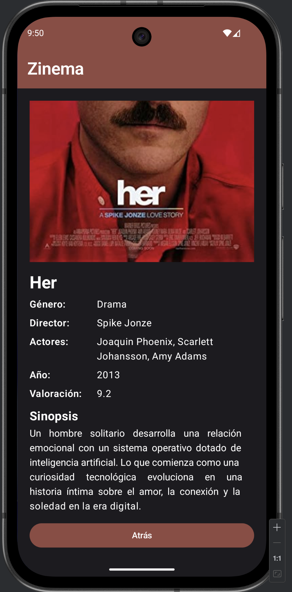
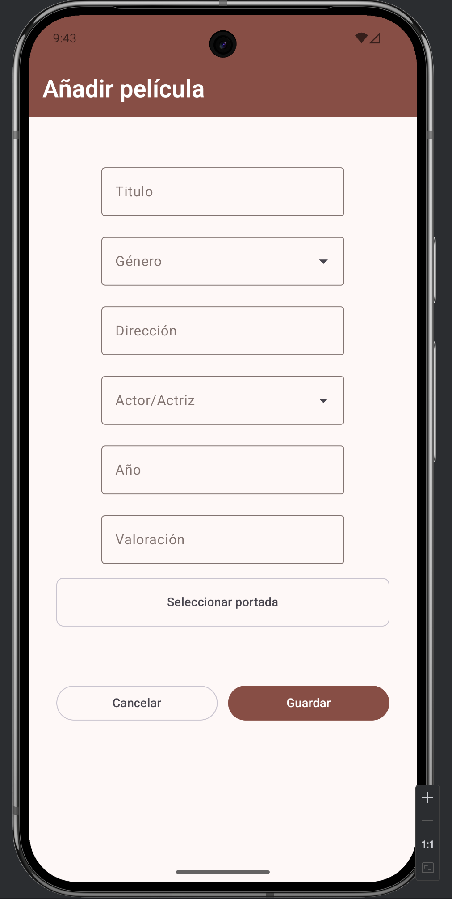
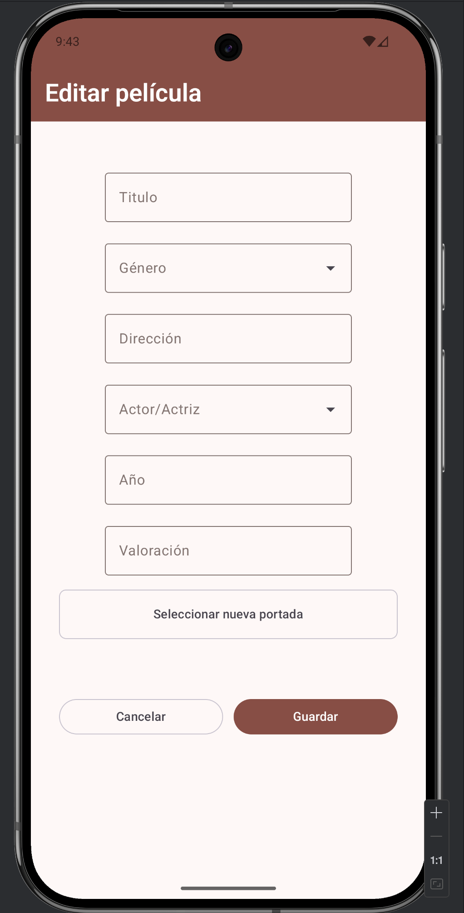

# Zinema - App Gestión de Películas

Este es un proyecto realizado en el contexto de un proyecto de clase de segundo curso del CS Dual de **Desarrollo de Aplicaciones Multiplataforma**. El proyecto consiste en la realización de un mock de un app de gestión de películas en Android desarrollada con **Jetpack Compose y Kotlin**. 

El proyecto está preparado para añadir funcionalidades más adelante.

Esta maqueta está constituída por las pantallas principales que en un futuro constituirán la aplicación real:

**LoginScreen**

Esta pantalla es la pantalla de inicio donde el usuario/a ingresará sus credenciales para loguearse en la app. Desde esta pantalla podremos también movernos a la pantalla de registro en caso de que no tengamos una cuenta en la app. 

**SignUpScreen**

Esta es la pantalla para registrase. Consta de diferentes Outlined Text Fields donde se introducirán:

- Un correo electrónico
- Username
- Una contraseña
- Repetir la contraseña
- Teléfono

Así también como unos Checkboxes para recordar la cuenta y para aceptar las términos y condiciones (solo hace el check, lógica no implementada)

Una vez se cubren los campos adecuadamente y son validados **el correo ha de ser válido y las contraseñas introducidas coincidir, así como tener entre 4 y 7 caracteres como mínimo)**. Una vez se han validado los datos, el último correo válido registrado aparecerá por defecto en la LoginScreen (pantalla de inicio).

Si se clica en el Button **"Log In"** nos moveremos a la pantalla **FilmListScreen**

**FilmListScreen**

Simulará una lista de películas contenidas en Cards donde aparecerá la información principal, además de dos botones para editar y eliminar la película seleccionada(dispará un **Dialog** de confirmación). Si se mantiene pulsada la Card de la película elegida nos moveremos a **DetailFilmScreen**.

**DetailFilmScreen**

En esta pantalla aparecerán todos los datos de cada película.

**AddFilmScreen y EditFilmScreen**

En la **BottomBar** de la pantalla con la lista de películas tendemos un icono de añadido de películas donde podremos añadir la película que deseemos. Tendremos diferentes **Outlined Text Fields** para añadir los datos.

Dentro de cada **Card** el icono de edición nos llevará a la pantalla de edición, la cual es una pantalla en apariencia igual que la pantalla de añadido. Aquí se podrán cambiar los datos de la película que estimemos.

**FUNCIONALIDADES FUTURAS**

- Añadir una lógica correcta de inicio de sesión
- Lógica de añadido, borrado y edición de películas
- Conexión con una API desde donde se obtendrán los datos.
- Nuevas funcionalidades que pueda requerir la app real.

**Esto es una maqueta que principalmente muestra el frontend de la app, no es un app real**

